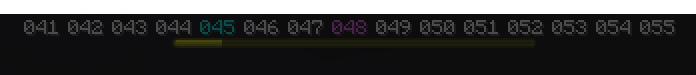

<p align="center">
  
</p>

---

### Optional Dependencies

- ProtocolLib (recommended) - update the compass when you turn your head

## Demonstration

| display |         GIF-preview         |
|---------|:---------------------------:|
| DEGREES |  |
| RUST    |     |
| SIMPLE  |   |
| RUSTME  |   |
| PURPUR  |   |

## Settings (settings.yml)

```yaml
compass-settings:
  type: BOSSBAR # BOSSBAR, ACTIONBAR
  display: RUST # RUST, RUSTME, SIMPLE, DEGREES, PURPUR
  boss-bar:
    color: WHITE # PINK, BLUE, RED, GREEN, YELLOW, PURPLE, WHITE
    overlay: PROGRESS # PROGRESS, NOTCHED_6, NOTCHED_10, NOTCHED_12, NOTCHED_20
    show-progress: false
display-settings:
  degrees:
    color: white # Also supports hex colors: '#ABCDEF'
    color-center: light_purple
  rust:
    color: white
    marker-symbol: ▼
    delimiter: '|'
  purpur:
    view-length: 50
    string: 'S  ·  ◈  ·  ◈  ·  ◈  ·  SW  ·  ◈  ·  ◈  ·  ◈  ·  W  ·  ◈  ·  ◈  ·  ◈  ·  NW  ·  ◈  ·  ◈  ·  ◈  ·  N  ·  ◈  ·  ◈  ·  ◈  ·  NE  ·  ◈  ·  ◈  ·  ◈  ·  E  ·  ◈  ·  ◈  ·  ◈  ·  SE  ·  ◈  ·  ◈  ·  ◈  ·  '
waypoint-settings:
  cardinal-color: aqua
```

## API 

### Gradle

Add the following lines to your `build.gradle` file:

```groovy
repositories {
    mavenCentral()
    maven { url 'https://jitpack.io' }
}

dependencies {
    compileOnly 'com.github.alcoloid0.HorizontalCompass:api:1.1'
}
```

### Maven

For Maven projects, include the JitPack repository and dependency in your `pom.xml`:

```xml
<repositories>
    <repository>
        <id>jitpack.io</id>
        <url>https://jitpack.io</url>
    </repository>
</repositories>
```

```xml
<!-- HorizontalCompass API -->
<dependency>
    <groupId>com.github.alcoloid0.HorizontalCompass</groupId>
    <artifactId>api</artifactId>
    <version>1.1</version>
</dependency>
```

## License

HorizontalCompass is licensed under the GNU General Public License v3.0. See [COPYING](COPYING) for more information.
